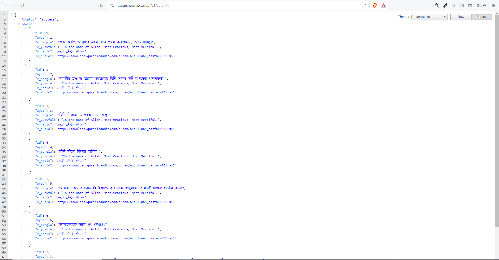

# Quran RESTful API with Express.js and Mysql 

This project provides a RESTful API service for retrieving information about Quranic verses in multiple languages. It includes endpoints to fetch information about all Surahs as well as specific Surahs by their IDs.




#### Live Url : https://quran.netwix.xyz/api/v1/surah :  Retrieve information about all Surahs.
#### Live Url : https://quran.netwix.xyz/api/v1/surah/1 :  Retrieve information about a specific Surah by its ID.


## Usage

### Endpoints

- GET /api/v1/surah: Retrieve information about all Surahs.
- GET /api/v1/surah/:id: Retrieve information about a specific Surah by its ID.

### Response Format
The API responses are formatted in JSON and include the following fields:

- status: Indicates the status of the request (success or error).
- data: Contains the requested data if the request is successful.
- message: Provides additional information about the response, especially in case of errors.

### Installation

1. **Clone the repository:**

   ```bash
   git clone https://github.com/your-username/quran-api-service.git

2. **Install dependencies:**

   ```bash
   cd your-repository
   npm install

3. **Start the server:**

   ```bash
   npm start
   
3. **Open your browser and go to http://localhost:3333.**

## Dependencies

- **Express:** [Express](https://www.npmjs.com/package/express)
- **MySql:** [MySql](https://www.npmjs.com/package/mysql)

## Contributing

Feel free to contribute by opening issues or submitting pull requests.

## License

This project is licensed under the MIT License - see the [LICENSE](LICENSE) file for details.


   
